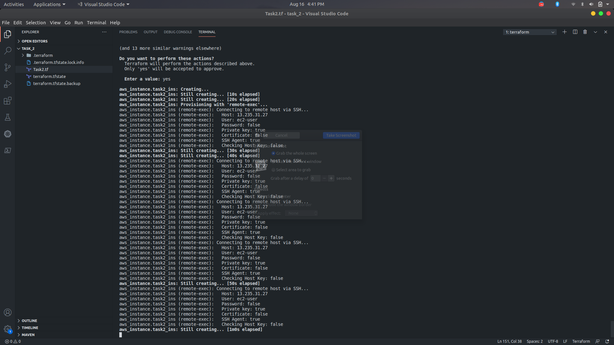

## The Project

## THE TASK DISCRIPTION
### 1. Create Security group which allow the port 80.
### 2. Launch EC2 instance.
### 3. In this Ec2 instance use the existing key or provided key and security group which we have created in step 1.
### 4. Launch one Volume using the EFS service and attach it in your vpc, then mount that volume into /var/www/html
### 5. Developer have uploded the code into github repo also the repo has some images.
### 6. Copy the github repo code into /var/www/html
### 7. Create S3 bucket, and copy/deploy the images from github repo into the s3 bucket and change the permission to public readable.
### 8 Create a Cloudfront using s3 bucket(which contains images) and use the Cloudfront URL to  update in code in /var/www/html

## STEPS :
 ### 1 :- First of all I  create a VPC .
```
resource "aws_vpc" "vishnupal_vpc" {
  cidr_block           = "192.168.0.0/16"
  instance_tenancy     = "default"
  enable_dns_hostnames = true
  tags = {
    Name = "vpc_of_vishnupal"
  }
}
```
### 2 subnet

```
resource "aws_subnet" "vishnupal_subnet" {
  vpc_id                  = "${aws_vpc.vishnupal_vpc.id}"
  cidr_block              = "192.168.0.0/24"
  availability_zone       = "ap-south-1a"
  map_public_ip_on_launch = "true"
  tags = {
    Name = "subnet_of_vishnupal"
  }
}
```
### 3 Security Group

```


resource "aws_security_group" "sg_vishnupal" {

  name   = "vp_sg"
  vpc_id = "${aws_vpc.vishnupal_vpc.id}"


  ingress {

    from_port   = 80
    to_port     = 80
    protocol    = "tcp"
    cidr_blocks = ["0.0.0.0/0"]

  }
  ingress {
    description = "allow_https"
    from_port   = 443
    to_port     = 443
    protocol    = "tcp"
    cidr_blocks = ["0.0.0.0/0"]
  }


  ingress {

    from_port   = 2049
    to_port     = 2049
    protocol    = "tcp"
    cidr_blocks = ["0.0.0.0/0"]

  }


  ingress {

    from_port   = 22
    to_port     = 22
    protocol    = "tcp"
    cidr_blocks = ["0.0.0.0/0"]

  }


  egress {

    from_port   = 0
    to_port     = 0
    protocol    = "-1"
    cidr_blocks = ["0.0.0.0/0"]
  }


  tags = {

    Name = "sg_of_vishnupal"
  }
}
```

### 5 EFS

```
resource "aws_efs_mount_target" "vishnupal_efs_mount" {
  file_system_id  = "${aws_efs_file_system.vishnupal_efs.id}"
  subnet_id       = "${aws_subnet.vishnupal_subnet.id}"
  security_groups = [aws_security_group.sg_vishnupal.id]
}


resource "aws_internet_gateway" "vishnupal_gw" {
  vpc_id = "${aws_vpc.vishnupal_vpc.id}"
  tags = {
    Name = "vishnupal_gw"
  }
}
```
### 6 INT & route 

```
resource "aws_route_table" "vishnupal_rt" {
  vpc_id = "${aws_vpc.vishnupal_vpc.id}"

  route {
    cidr_block = "0.0.0.0/0"
    gateway_id = "${aws_internet_gateway.vishnupal_gw.id}"
  }

  tags = {
    Name = "vishnupal_rt"
  }
}


resource "aws_route_table_association" "vishnupal_rta" {
  subnet_id      = "${aws_subnet.vishnupal_subnet.id}"
  route_table_id = "${aws_route_table.vishnupal_rt.id}"
}
```
### 7 instance

```
resource "aws_instance" "task2_ins" {
  ami             = "ami-052c08d70def0ac62"
  instance_type   = "t2.micro"
  key_name        = "test_vpc"
  subnet_id       = "${aws_subnet.vishnupal_subnet.id}"
  security_groups = ["${aws_security_group.sg_vishnupal.id}"]


  connection {
    type        = "ssh"
    user        = "ec2-user"
    private_key = file("/home/vishnupal/Downloads/test_vpc.pem")
    host        = aws_instance.task2_ins.public_ip
  }

  provisioner "remote-exec" {
    inline = [
      "sudo yum install amazon-efs-utils -y",
      "sudo yum install httpd -y",
      "sudo yum install php -y",
      "sudo systemctl start httpd",
      "sudo systemctl enable httpd",
      "sudo yum install git -y",
      "sudo setenforce 0",
      "sudo yum -y install nfs-utils"
    ]
  }

  tags = {
    Name = "my_os"
  }
}
```
### 8 mount EFS

```
resource "null_resource" "mount" {
  depends_on = [aws_efs_mount_target.vishnupal_efs_mount]
  connection {
    type        = "ssh"
    user        = "ec2-user"
    private_key = file("/home/vishnupal/Downloads/test_vpc.pem")
    host        = aws_instance.task2_ins.public_ip
  }
  provisioner "remote-exec" {
    inline = [
      "sudo mount -t nfs -o nfsvers=4.1,rsize=1048576,wsize=1048576,hard,timeo=600,retrans=2,noresvport ${aws_efs_file_system.vishnupal_efs.id}.efs.ap-south-1.amazonaws.com:/ /var/www/html",
      "sudo rm -rf /var/www/html/*",
      
      "sudo git clone https://github.com/vishnupal/Hybrid_cloud_task_1.git /var/www/html/",
      "sudo sed -i 's/url/${aws_cloudfront_distribution.web_cloud.domain_name}/g' /var/www/html/index.php"
    ]
  }
}
```
### S3 Bucket policy
```
resource "aws_s3_bucket" "s3_bucket" {
  bucket = "vishnupalbuck"
  acl    = "private"

  tags = {
    Name = "s3_bucket"
  }
}
resource "aws_s3_bucket_public_access_block" "s3_type" {
  bucket              = "${aws_s3_bucket.s3_bucket.id}"
  block_public_acls   = true
  block_public_policy = true
}
```
### cloud frant
```
resource "aws_cloudfront_origin_access_identity" "origin_access_identity" {
  depends_on = [aws_s3_bucket.s3_bucket]
}
data "aws_iam_policy_document" "s3_policy" {
  statement {
    actions   = ["s3:GetObject"]
    resources = ["${aws_s3_bucket.s3_bucket.arn}/*"]
    principals {
      type        = "AWS"
      identifiers = [aws_cloudfront_origin_access_identity.origin_access_identity.iam_arn]
    }
  }
}
resource "aws_s3_bucket_policy" "policy" {
  bucket = aws_s3_bucket.s3_bucket.id
  policy = data.aws_iam_policy_document.s3_policy.json
}
locals {
  s3_origin_id = "myS3Origin"
}

resource "aws_cloudfront_distribution" "web_cloud" {
  origin {
    domain_name = "${aws_s3_bucket.s3_bucket.bucket_regional_domain_name}"
    origin_id   = "${local.s3_origin_id}"
    s3_origin_config{
      origin_access_identity = aws_cloudfront_origin_access_identity.origin_access_identity.cloudfront_access_identity_path
    }
  }
  enabled = true
  is_ipv6_enabled     = true
  default_cache_behavior {
    allowed_methods  = ["DELETE", "GET", "HEAD", "OPTIONS", "PATCH", "POST", "PUT"]
    cached_methods   = ["GET", "HEAD"]
    target_origin_id = "${local.s3_origin_id}"
forwarded_values {
      query_string = false
cookies {
        forward = "none"
      }
    }
viewer_protocol_policy = "allow-all"
    min_ttl                = 0
    default_ttl            = 3600
    max_ttl                = 86400
  }
restrictions {
    geo_restriction {
      restriction_type = "none"
    }
  }
viewer_certificate {
    cloudfront_default_certificate = true
  }
}
```
!



### instance

### Sg

### vpc 

### Subnet

### EFS

### ITG

### ROUTE

### S3

### CloudFrount

### Site 


